# Exercise04: インシデント管理

#### ⏳ 推定時間: 60分

#### 💡 学習概要

Microsoft Sentinel のインシデント管理機能を使用した SOC アナリストのエクスペリエンスについて学習します。

#### 🗒️ 目次

1. [Microsoft Sentinel インシデント ツールと機能の確認](#microsoft-sentinel-インシデント-ツールと機能の確認)
1. [インシデント「無効なアカウントに対するサインイン試行」の対応](#インシデント無効なアカウントに対するサインイン試行の対応)
1. [インシデント「Solorigate ネットワーク ビーコン」の対応](#インシデントsolorigate-ネットワーク-ビーコンの対応)


## Microsoft Sentinel インシデント ツールと機能の確認

#### インシデント情報

SOC アナリストとして、Sentinel でセキュリティ インシデント (チケット/ジョブ/ケースなど) に取り組むためのエントリ ポイントは、インシデントページです。

1. [調査と対応]-[インシデントとアラート]-[インシデント] を開く

    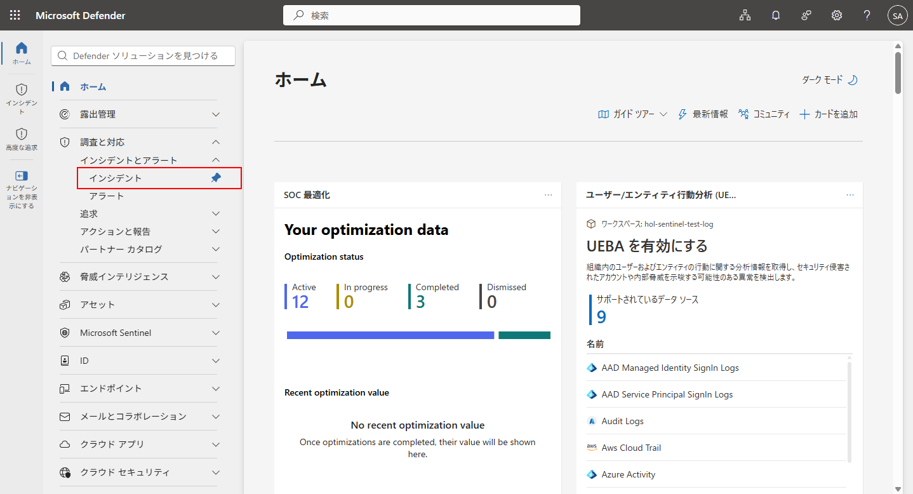

1. インシデント一覧画面の機能確認

    インシデント一覧画面について、以下を確認します。

    - 表示期間: インシデントページは指定した期間以内に発生したすべてのインシデントが表示されます。
                表示が多い場合、期間を絞ることで、最近のインシデントに集中できます。
    - フィルターの追加: その他利用可能なフィルタリングは以下の通りです。
        - 状態
        - アラートの重大度
        - エンティティ　　…など

    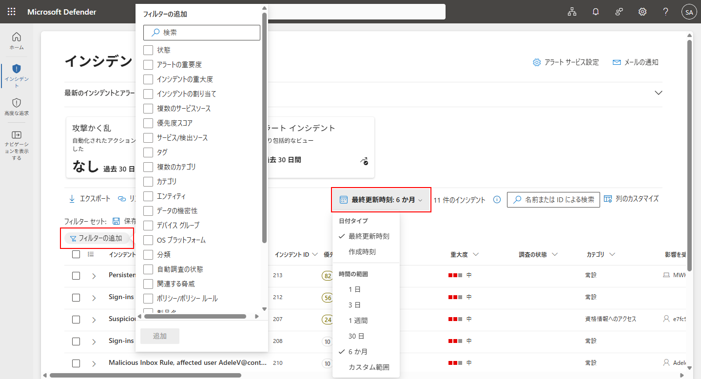

1. インシデント担当者を設定

    あなたはインシデントを調査している SME SOC アナリストです。
    対応が必要なインシデントを探し、所有権を取得する必要があります。

    1. インシデント一覧ページにて、 `Sign-ins from IPs that attempt sign-ins to disabled accounts` を検索してチェックを入れ、「インシデントの管理」を選択

        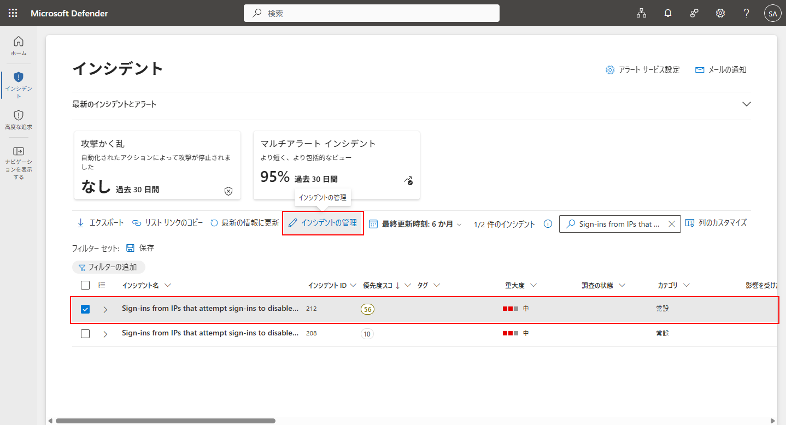

    1. 「割り当て先」を展開、「自分に割り当て」を選択、「保存」

        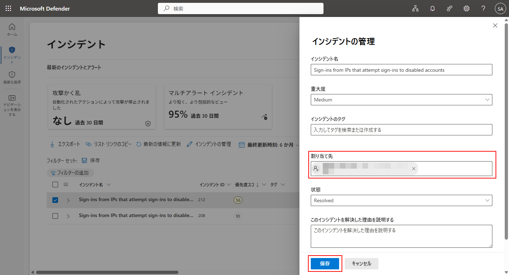


#### インシデント対応の効率

業務進捗の確認のため、一般的な SOC の健全性に関する概要を取得する必要があります。
セキュリティ効率ブックを利用して状況確認します。

1. [レポート] を開き、「全般」にある「統合されたセキュリティ サマリー」を開く

    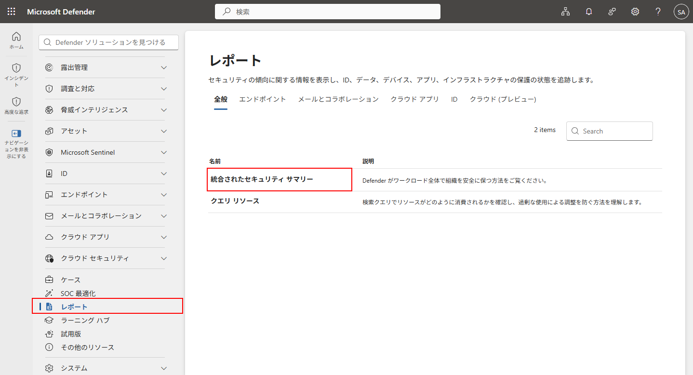

1. 右上の集計期間を確認

    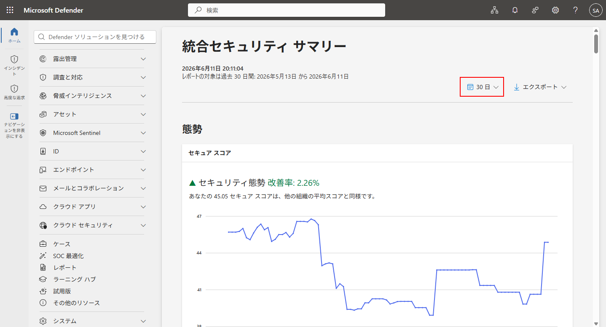

1. 下へスクロールして「調査と応答」エリアにある「インシデント対応」を確認  
    集計期間内に発生したインシデント数、解決したインシデント数を確認

    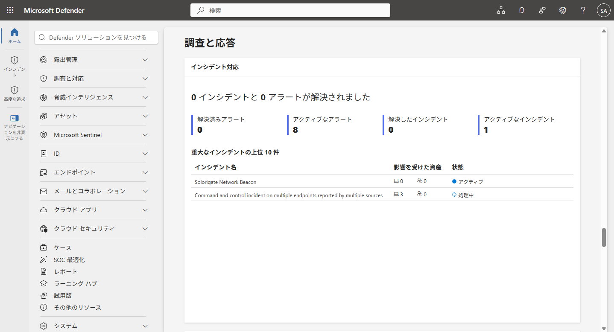


## インシデント「無効なアカウントに対するサインイン試行」の対応

インシデント処理手順の例を順に説明し、SOC アナリストが Sentinel を使用して達成できるいくつかのことを説明します。

#### 最初のインシデント処理

1. [調査と対応]-[インシデントとアラート]-[インシデント] を開き、`Sign-ins from IPs that attempt sign-ins to disabled accounts` を検索して選択

    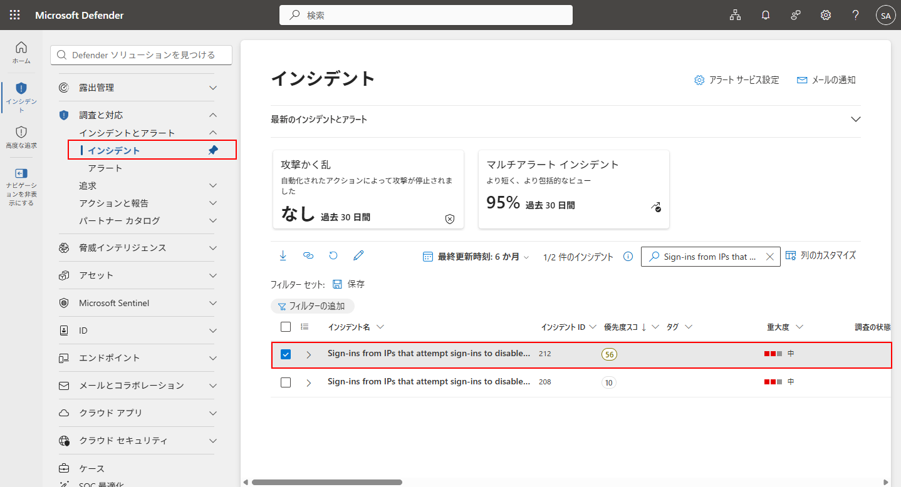

1. 右上「インシデントの管理」から、状態を進行中（In Progress）に変更

    1. 右上「インシデントの管理」を選択

        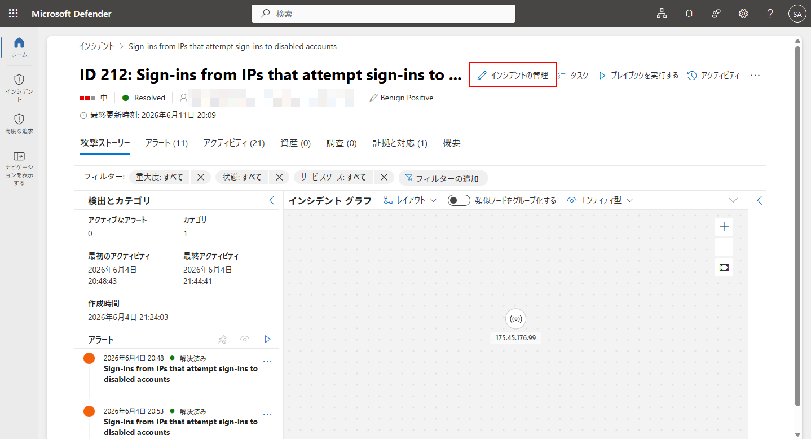

    1. 「割り当て先」を「自分自身」、「状態」を「進行中（In Progress）」に変更して「保存」

        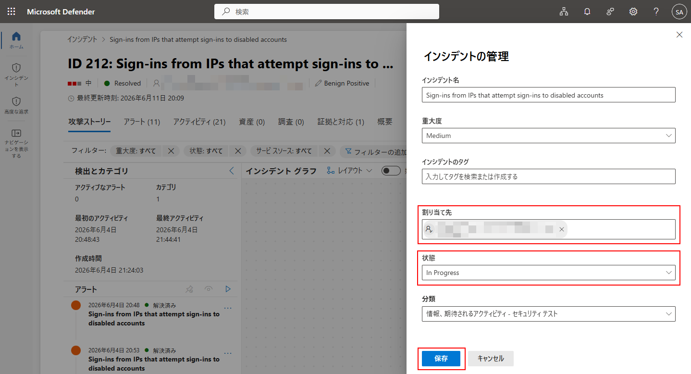

1. 「攻撃ストーリー」の「アラート」から最新アラート（一番下）を選択、「関連イベント」にあるログを展開して確認

    次のようなプロパティは、このインシデントが他のイベントと相関しているかどうかを判断するのに役立つ場合があります。

    - IPAddress
    - disabledAccountSet

    <!--  -->

1. 「証拠と対応」タブの「IPアドレス」に先ほど確認した IPアドレス ( `175.45.176.99` ) があることを確認、選択

    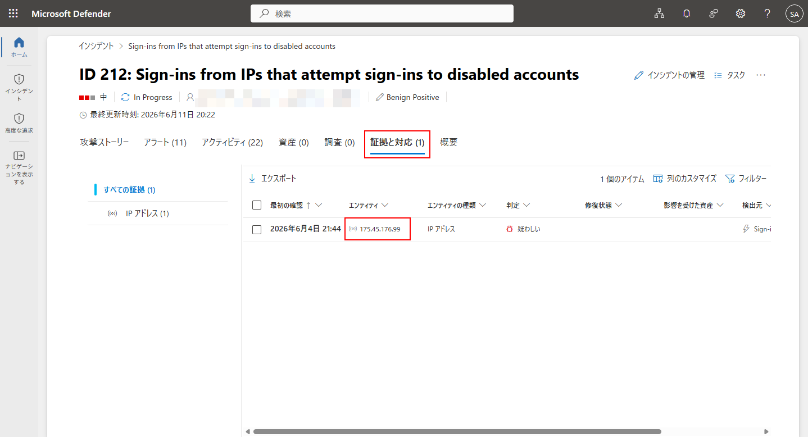

1. IPアドレスの詳細情報を確認

    - Gelocation information
        - Country: Korea (North) (北朝鮮)
        - City: Pyeongyang (平壌)

    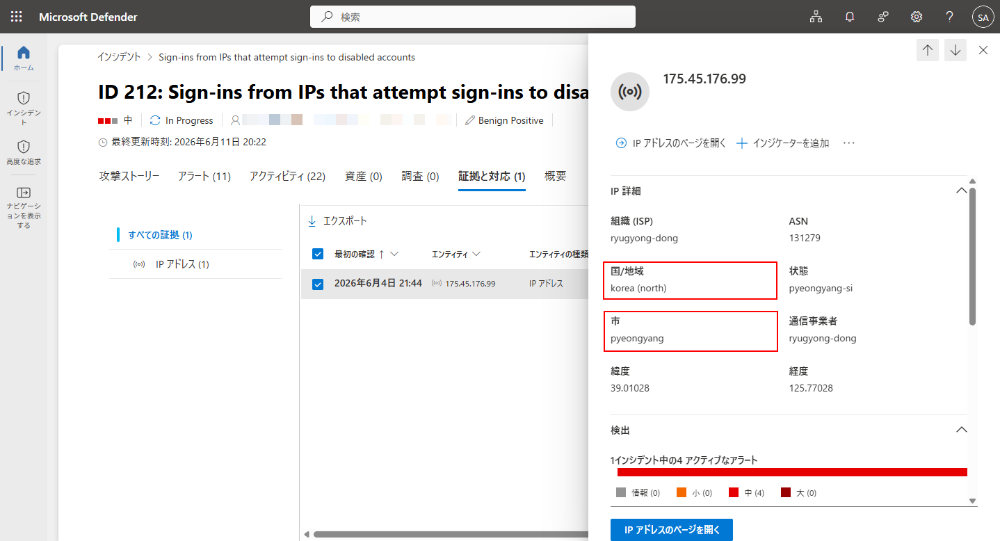

これらの情報から北朝鮮から不正アクセスがあったことがわかります。


#### ワークブックで継続調査

SOC アナリストとして、地理情報から不正アクセスの懸念が高まりました。
ネットワーク内でこの IP の他の痕跡を確認する必要があります。
この調査には、 Investigation Insights ワークブック を使用します。
(トレーニング ラボによって、既にワークスペースにコピーが保存されています。)

> [!TIP]  
> Defender ポータルからブックを開くと一部機能が正しく動作しないケースがあります。
> うまく動作しない場合、ブック上部にある「Azureで開く」から Azureポータル でブックを開いて動作確認してください。

1. [Microsoft Sentinel]-[脅威の管理]-[ブック] を開く

    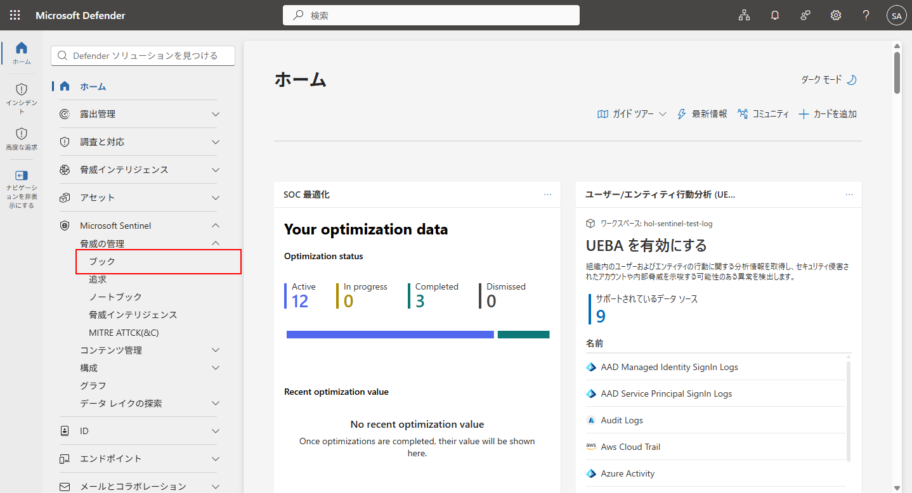

1. 「マイ ブック」タブにある `Investigation Insights` を選択、右ペインから「保存されたブックの表示」を開く

    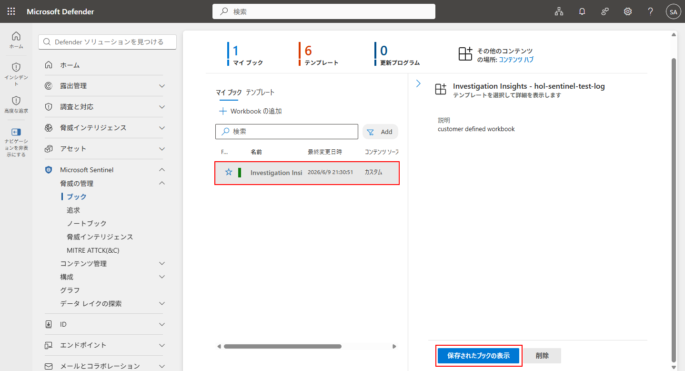

1. 上部「Azureで開く」を選択

    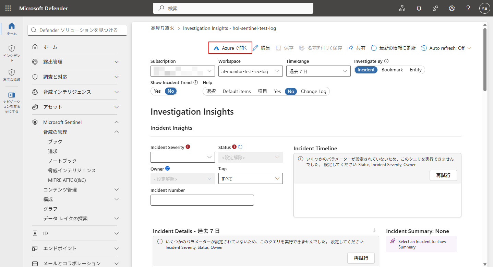

1. 上部プロパティの設定を確認

    - Subscription: (今回の演習で利用しているサブスクリプション)
    - Workspace: (今回の演習用に作成した Log Analytics Workspace)
    - TimeRange: (演習用の Log Analytics Workspace を作成した日が含まれる期間)

    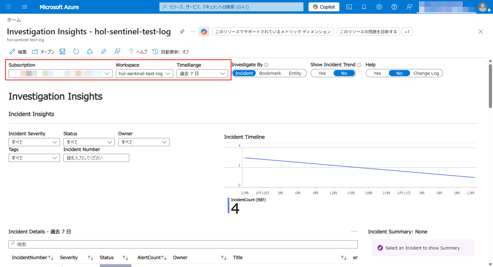

1. 下へスクロールして「Entity Insights」の「Investigate IP Address」に調査で判明したアクセス元IPアドレス `175.45.176.99` を入力

    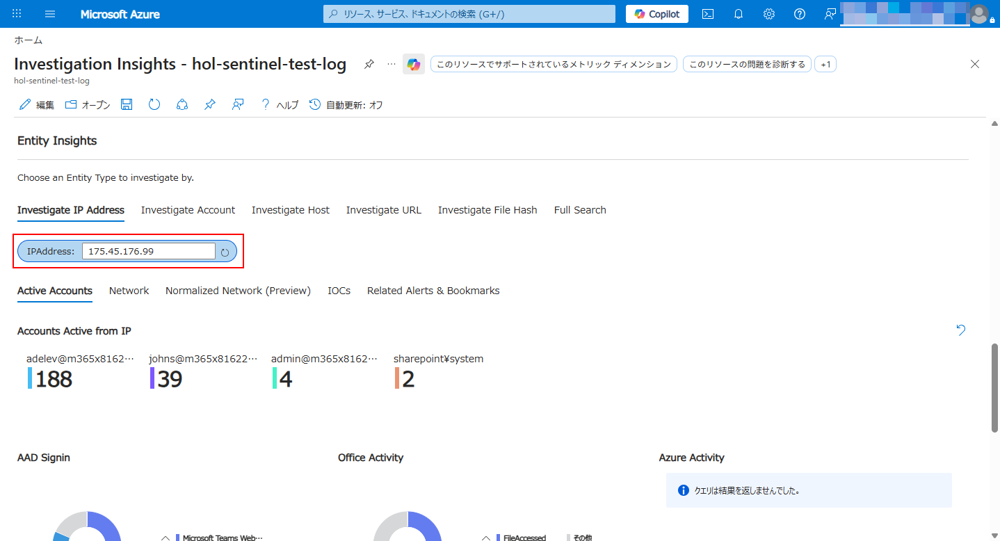

1. 下へスクロールして「Activity Detail」を確認

    このIPから `adelev@m365x816222.onmicrosoft.com` に対する複数のログイン試行があったことがわかります。

    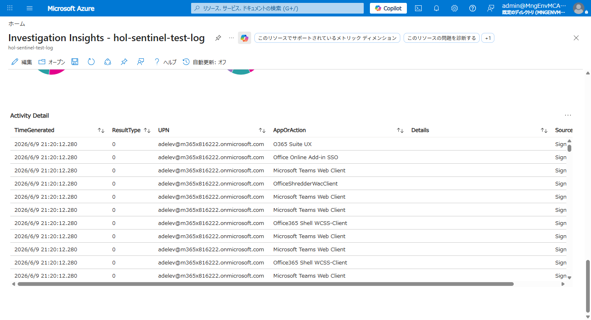

1. ユーザー ID `adelev@m365x816222.onmicrosoft.com` の調査 ...

    ユーザーIDをコピーし、社内の HR システムで検証したところ、
    収集した情報から、Adele は Security Red Team のメンバーであり、
    この疑わしい行動は 48 時間にわたって実行されている演習の一部であることが判明しました。


#### 調査結果を踏まえた対応の実施

Security Red Team の演習が当社によって発見されたため、
SOC マネージャーは、テストの実行中にこの IP からのインシデントの調査に時間を費やさないように、
この検出タイプに対してこの IP を許可リストに登録するよう依頼しました。
ルール定義自体を編集するのではなく、インシデント自動化ルールを使用します。

1. [Microsoft Sentinel]-[構成]-[オートメーション] を開く

    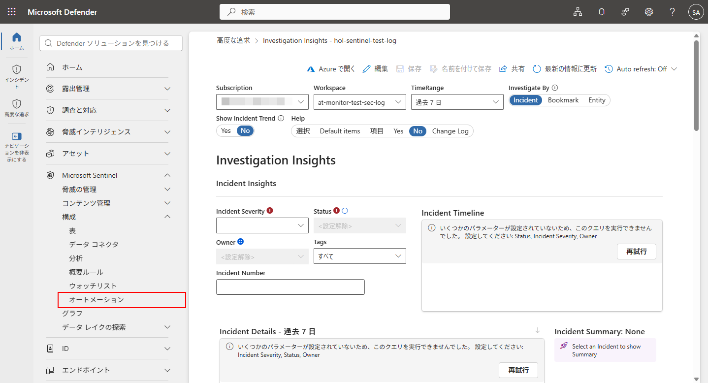

1. 右上 [作成]-[自動化ルール] を選択

    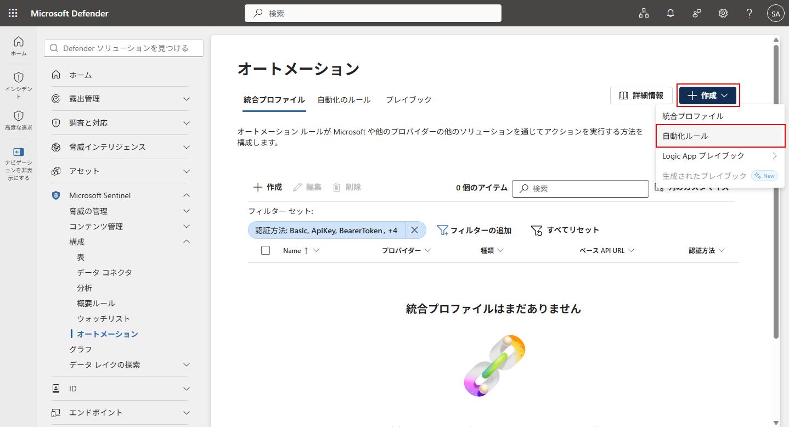

1. オートメーションルールの作成

    次の設定を行って「作成」

    - ルールの種類: `標準ルール`
    - オートメーションルール名: `Sign-ins from IPs that attempt sign-ins to disabled accounts`
    - トリガー: `インシデントが作成されたとき (When incident is created)`
    - ワークスペース: (今回の演習用に作成した Log Analytics Workspace)
    - 条件
        - `Group operator` `AND`
            - `分析ルール名` `次を含む (Containes)` `Sign-ins from IPs that attemptto sing-in disabled account`
            - `IPアドレス` `次と等しい (Equals)` `175.45.176.99`
    - 操作
        - `状態の変更`
        - `終了`
        - `無害な陽性 - 不信ですが、予期されています`
        - `コメント: (任意)`
    - ルールの有効期限
        - (48時間後に設定) ★←ここを修正★
    - 順序: `1`

    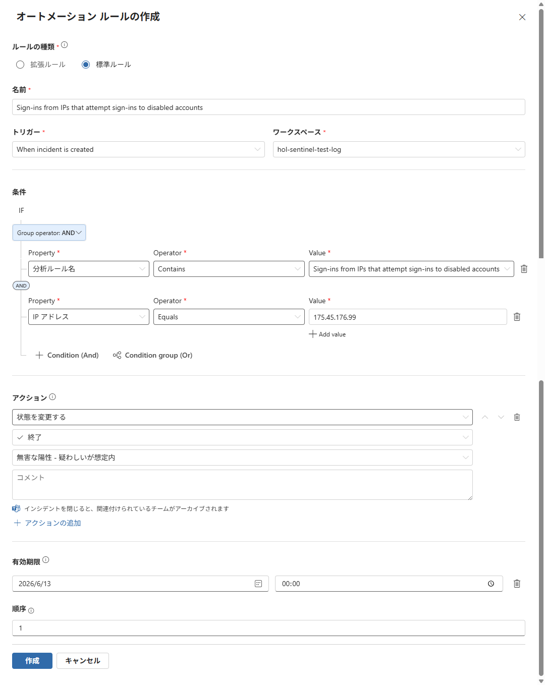

#### ステータス更新してインシデント クローズ

すでに発生してしまったインシデントは Security Red Team の演習によるもので、
無害であることが判明したため、終了します。

1. [調査と対応]-[インシデントとアラート]-[インシデント] を開き、`Sign-ins from IPs that attempt sign-ins to disabled accounts` を検索して選択、「インシデントの管理」を選択

    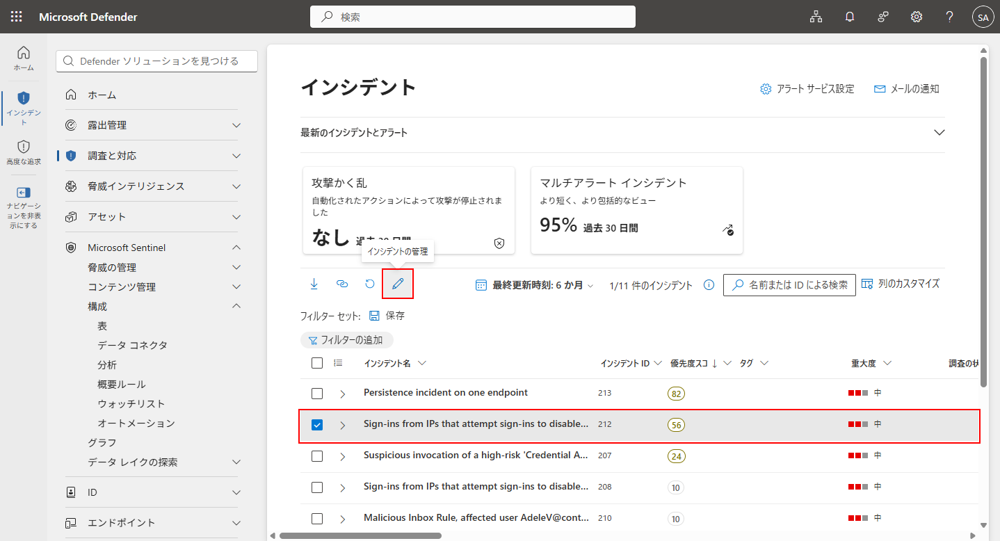

1. 状態を解決（Resolved）にして、閉じる

    以下を設定して「保存」を選択

    - 状態: `解決 (Resolved)`
    - コメント: `Security Red Team による演習`
    - 分類: `情報、期待されるアクティビティ - セキュリティ テスト`

    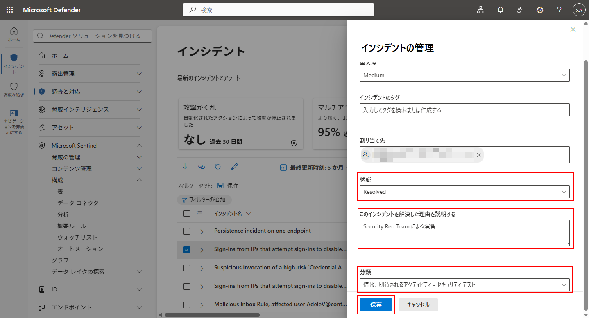


## インシデント「Solorigate ネットワーク ビーコン」の対応

インシデント処理手順の例を順に説明し、
SOC アナリストが Sentinel を使用して達成できるいくつかのことを説明します。

> [!INFO]  
> **参考: Solorigate攻撃**  
> Solorigate攻撃は、2020年末に発覚した SolarWinds 社の製品をターゲットにした攻撃です。
> 攻撃者は同社のサーバーに侵入し、何らかの方法で Orion Platform の ソフトウェア 更新パッケージに バックドアを挿入しました。
> SolarWindsのOrion Platformは多くの企業や政府機関で広く使用されており、
> 利用していた組織にはアメリカ合衆国政府機関や多国籍企業が含まれていました。
> 更新パッケージが配布されると攻撃者は Orion Platform 利用組織に対して不正アクセスし、機機密報などの盗難を行いました。

#### 最初のインシデント処理

1. [調査と対応]-[インシデントとアラート]-[インシデント] を開き、`Solorigate Network Beacon` を検索してチェックを入れ、「インシデントの管理」を選択

    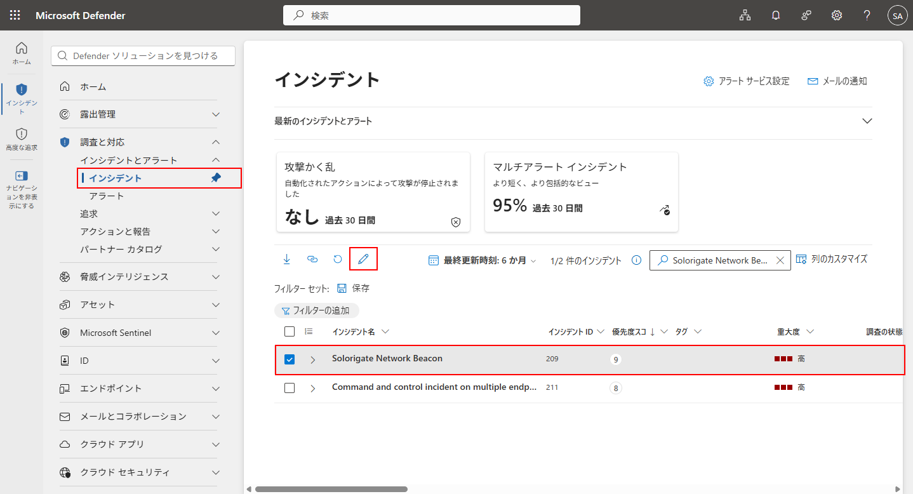

1. 右ペインで以下を設定して「保存」を選択

    - 割り当て先: `自分に割り当て`
    - 状態: `進行中 (In Progress)`

    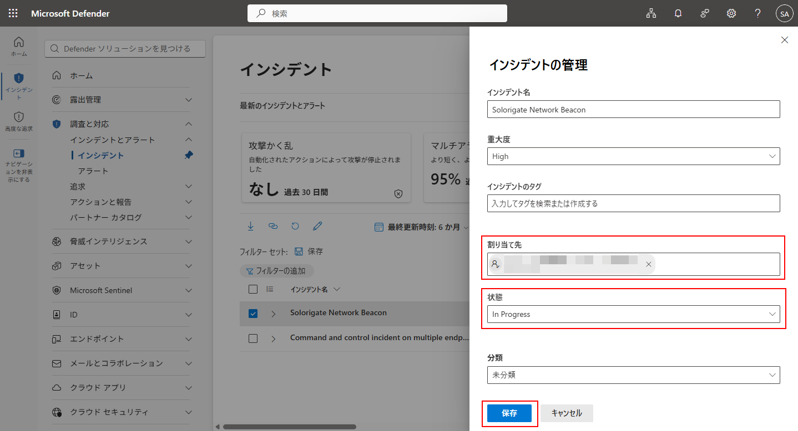

1. `Solorigate Network Beacon` を選択して詳細を確認

    「攻撃ストーリー」の「インシデントグラフ」を確認すると、
    Solorigate 攻撃に関連するドメイン IOC の 1 つが見つかりました。
    このケースでは、ドメイン `avsvmcloud.com` が関係しています。

    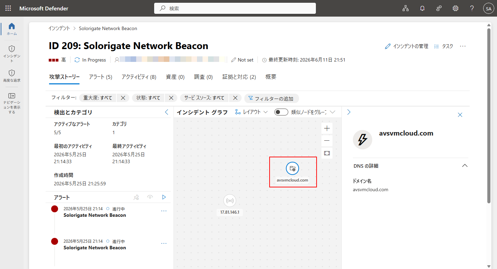

1. 「攻撃ストーリー」の「アラート」一覧から任意のアラートを選択、「関連イベント」からクエリ結果（もとになったログ）を展開

    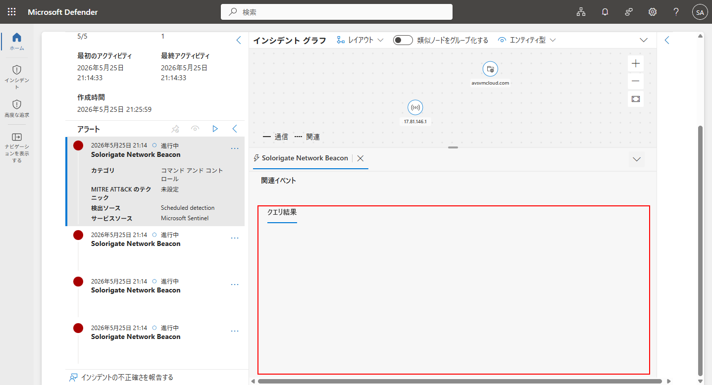

1. インシデントの元となったログを確認

    ご覧のとおり、イベントは `Cisco Umbrella DNS` で発生していることがわかります。
    分析ルール Advanced Security Information Model (ASIM) によって
    任意の DNS ソースからのイベントが EventProduct や EventVender などに正規化されています。
    詳細については [ASIM](https://learn.microsoft.com/azure/sentinel/normalization) と [DNS スキーマ](https://learn.microsoft.com/azure/sentinel/normalization-schema-dns) を参照してください。

    <!--  -->


#### 追加調査~インシデントへ情報追加

侵害を受けた可能性のあるホストを特定します。
調査の中で、[Microsoft からの ガイダンス](https://techcommunity.microsoft.com/t5/azure-sentinel/solarwinds-post-compromise-hunting-with-azure-sentinel/ba-p/1995095) を見つけました。
この記事には、SolarWinds インベントリ チェックを実行するクエリが記載されています。
このクエリを使用して、影響を受けた他のホストを検索、見つかったホストをインシデントへリンクします。

1. [Microsoft Sentinel]-[脅威の管理]-[追求] を開き、「クエリ」タブへ移動

    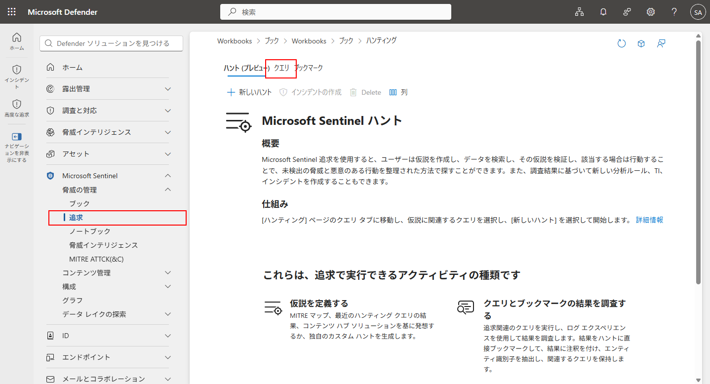

1. `Solorigate Inventory check` を探して選択、右ペインから「結果を表示」を押下

    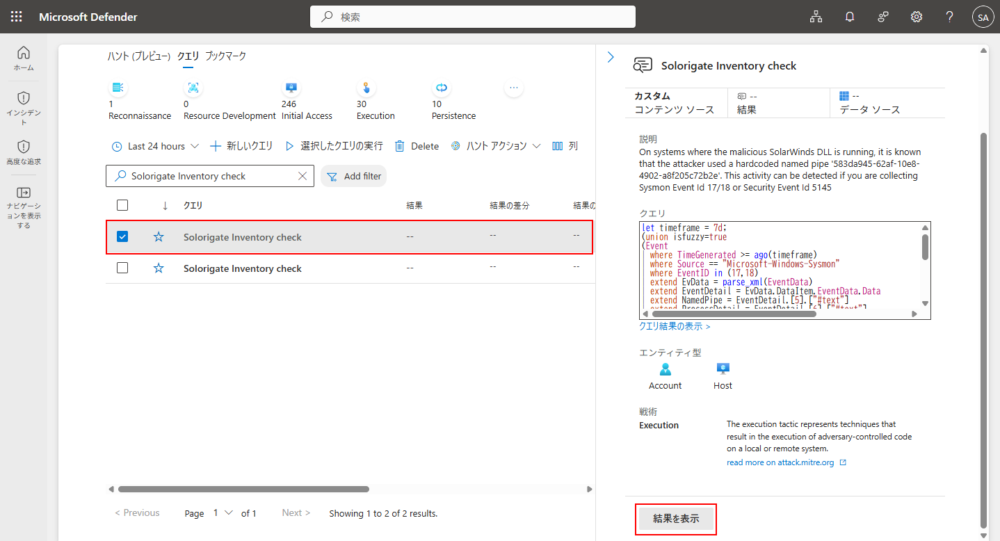

1. 「高度な追求」画面で再度「クエリを実行」を押下

    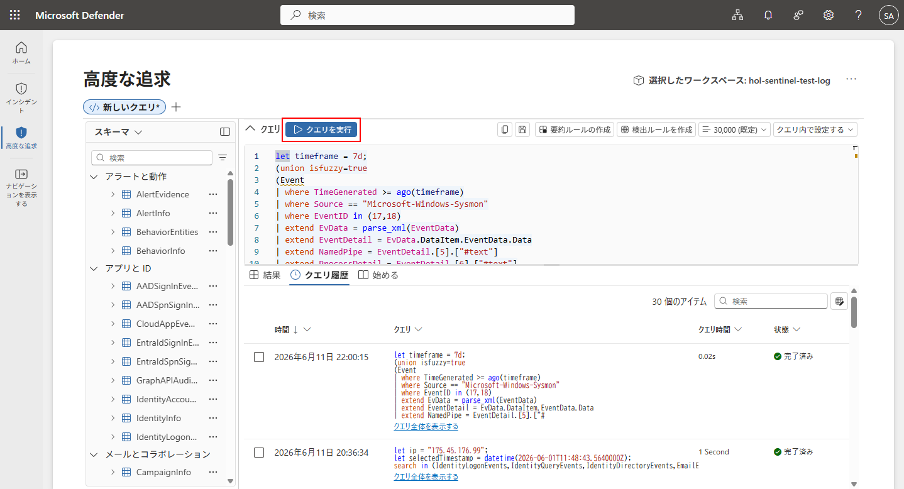

1. ログペインの内容を確認

    ご覧のとおり、ClientPC のほかに、
    悪意のある DLL と名前付きパイプが見つかったコンピュータが 3 台あります。

    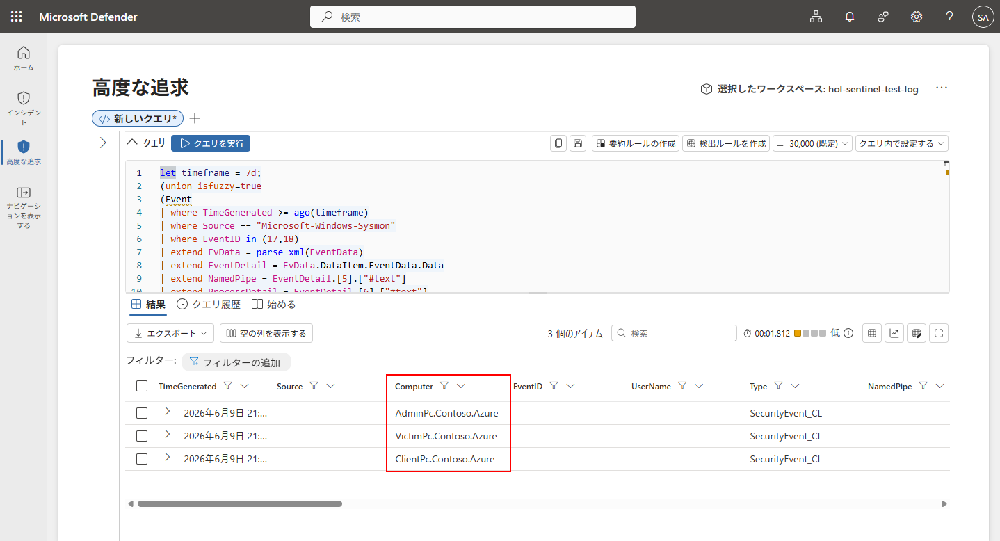

1. レコードをすべて（3行）選択し、「インシデントへのリンク」を選択

    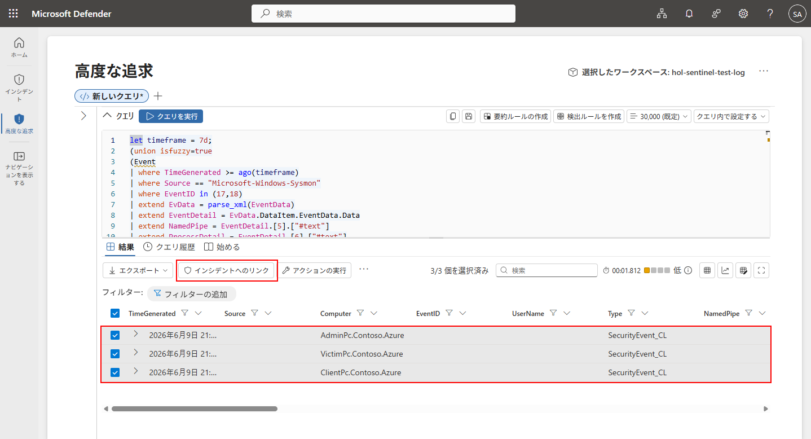

1. インシデントへのリンク

    1. アラートの詳細

        - `警告を既存のインシデントに関連付け`
        - インシデント名またはID: `Solorigate Network Beacon`
        - アラートのタイトル: `Solorigate Inventory check`
        - 重大度: `高`
        - カテゴリ: `コマンド アンド コントロール`
        - MITREのテクニック: (指定なし)
        - 説明: (任意。例: `Solorigate攻撃に関連するドメインへのネットワークビーコンを特定`) 
        - おすすめのアクション: (空欄)

        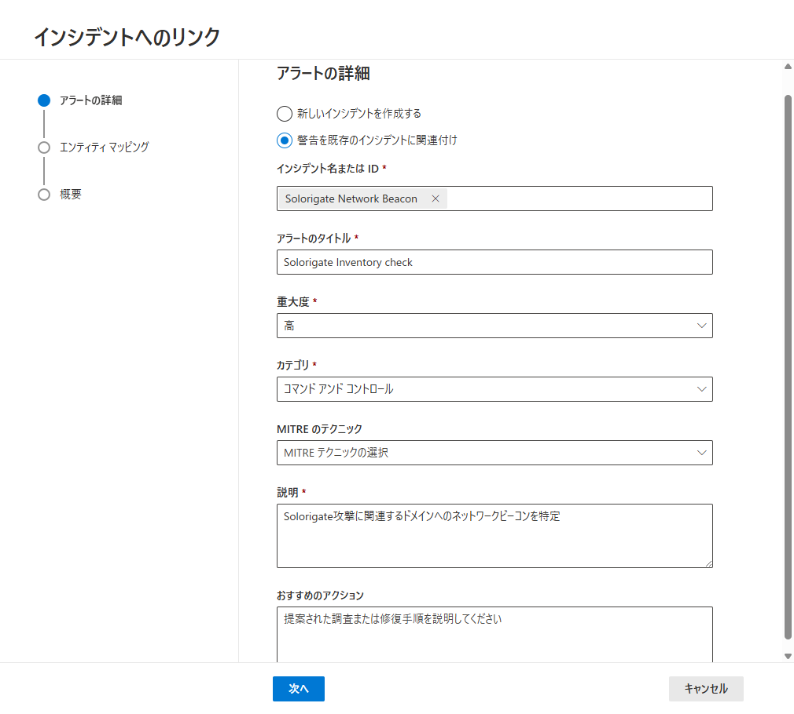

    1. エンティティマッピング

        - 影響を受けた資産

            | エンティティ | 識別子 | 列 |
            | --- | --- | --- |
            | User | `CloudAppAccountId` | `AccountCustomEntity` |
            | Device | `HostName` | `HostCustomEntity` |

        - 関連するエビデンス

            なし

        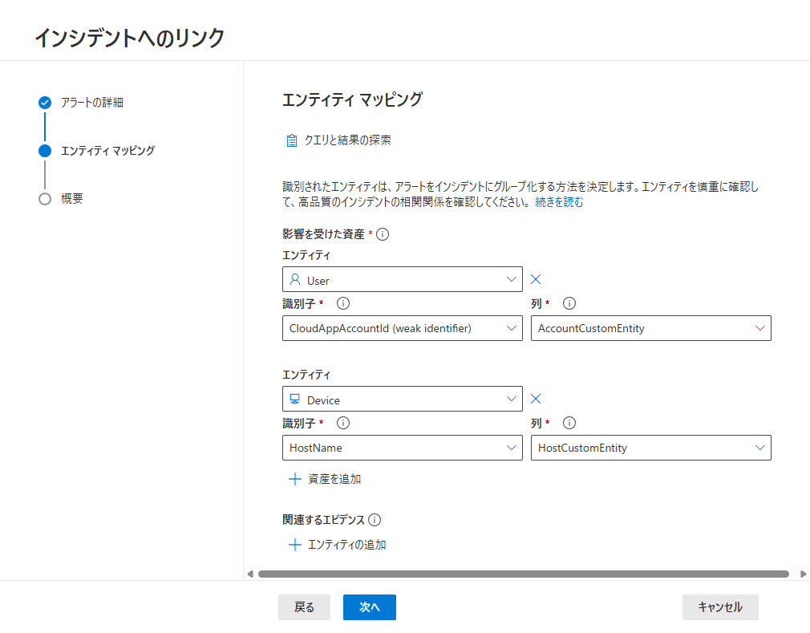

    1. 概要

        内容を確認して「送信」

        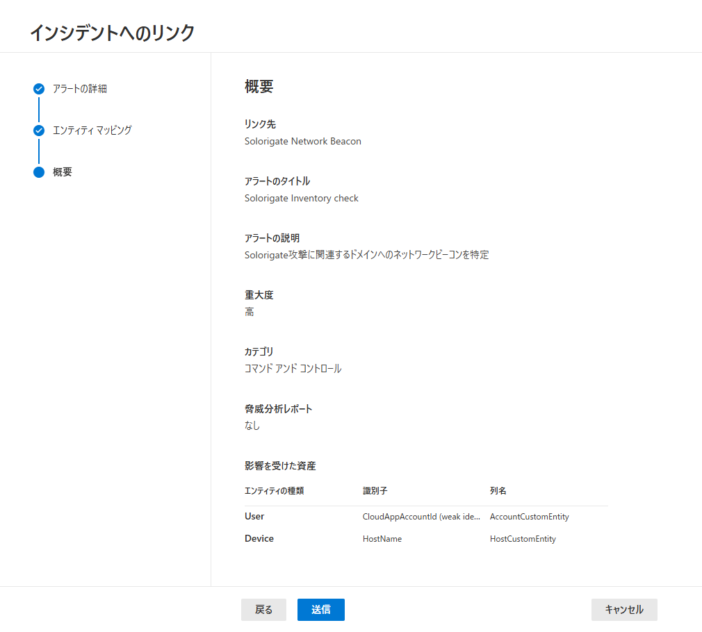

この時点で、運用チームに依頼し、このインシデントの影響を受けたホストを隔離します。


#### 侵害インジケーター へ IPアドレス 追加

インシデントに関連するIPアドレスをSentinelワークスペースの脅威インテリジェンスストアの侵害インジケーター(Indicators of Compromise, IOC)リストに追加して、
ログ全体でこのIOCの新たな発生をキャプチャできるようにします。

> [!INFO]  
> インシデントに追加情報を関連付けたことで、インシデント名が `Command and control incident on multiple endpoints reported by multiple sources` のように変わっている場合があります。
> アラート名でもある `Solorigate Network Beacon` で検索をするとインシデントを見つけやすいかもしれません。

1. [調査と対応]-[インシデントとアラート]-[インシデント] を開き、`Solorigate Network Beacon` を検索して開く

    (*) インシデント名 `Command and control incident on multiple endpoints reported by multiple sources` のように変わっている場合があります。

    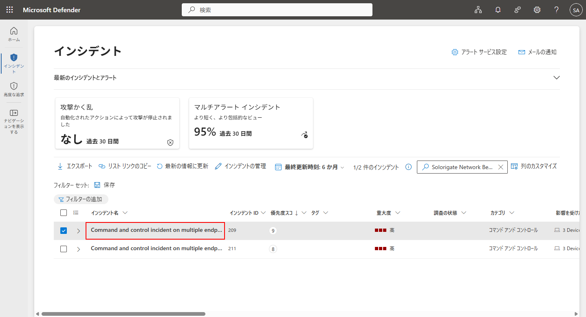

1. 関連する IPアドレス (`17.81.146.1`) をコピー

    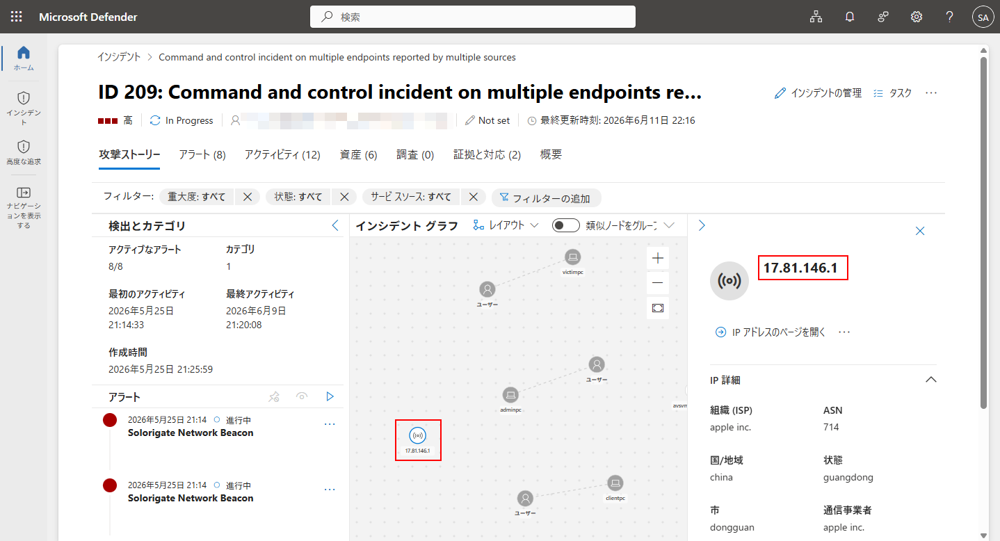

1. [脅威インテリジェンス]-[Intel の管理] へ移動

    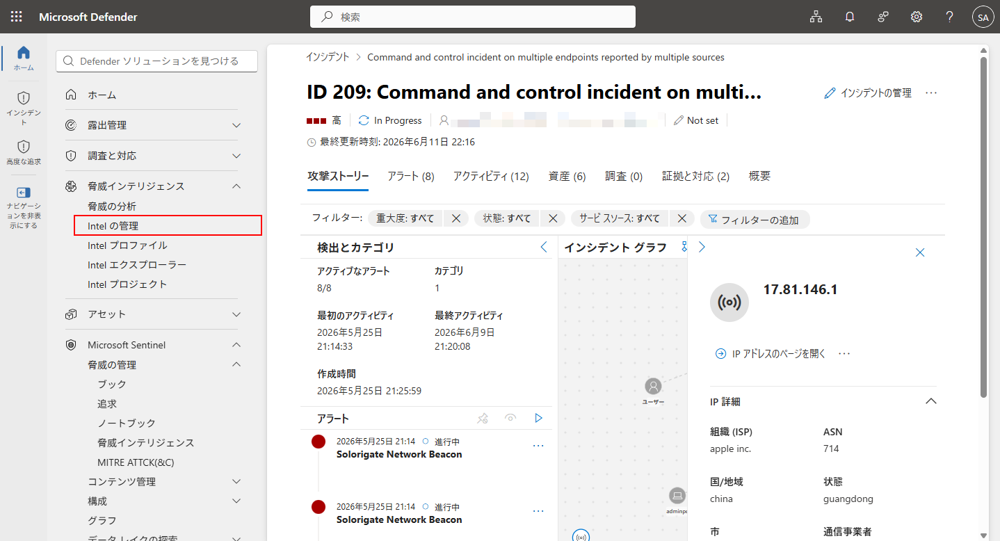

1. 上部メニュー [新規]-[TIオブジェクト] を選択

    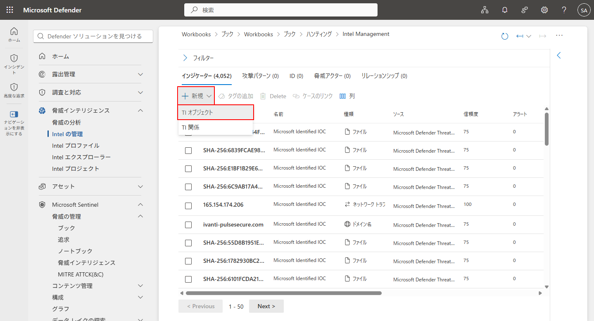

1. 新しいインジケーターの作成

    以下の設定を行って「追加」

    - オブジェクトの種類: `インジケーター`
    - パターン: `パターンビルダー`
        - 新しい監視可能対象: `IPv4 アドレス`
        - IPv4 アドレスの値: `17.81.146.1`
    - 名前: `mal_ip: 17.81.146.1`
    - インジケーターの種類: `悪意のあるアクティビティ (malcious-activity)`
    - キルチェーン: (設定なし)
    - 有効期限の開始日: (本日の日付)
    - 有効期限: (2ヶ月後)
    - ソース: `Microsoft Sentinel` (デフォルトまま)
    - 作成済み, 変更済み: (デフォルトまま)
    - 説明: `Solorigateキャンペーン関連`
    - 取り消し済み: `false(チェックしない)`
    - 信頼度: `90`

    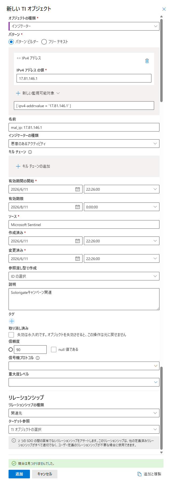


#### インシデントの引き渡し

インシデントを別のチーム(オペレーションやフォレンジックなど)に引き渡すために、
行ったことが文書化されていることを確認する準備をします。

1. [調査と対応]-[インシデントとアラート]-[インシデント] を開き、`Solorigate Network Beacon` を検索して開く

    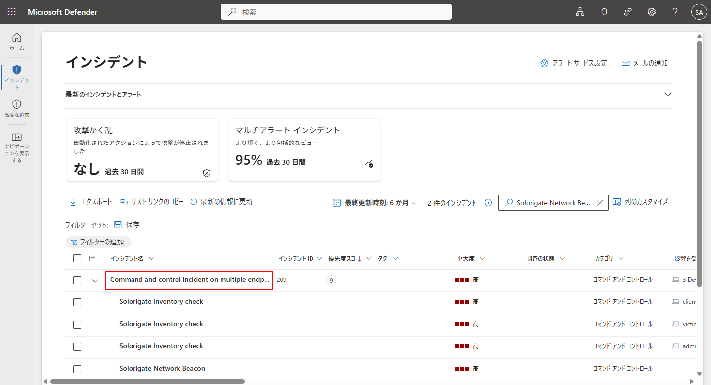

1. 「アクティビティ」タブを開き、「コメントを追加」を選択

    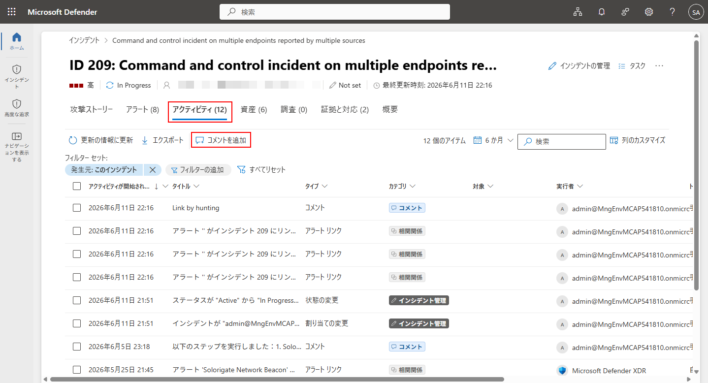

1. 右ペインのコメント欄に実行したことを記載して「保存」を選択

    ```
    以下のステップを実行しました：
    1. Solorigate攻撃に関連するドメインへのネットワークビーコンを特定
    2. ハンティングクエリを使用して、影響を受けたホストを特定
    3. 影響を受けたホストをさらに2つ検出
    4. インシデントに証跡（エビデンス）を追加
    5. 脅威インテリジェンスにIPアドレスIOCを追加
    6. 隔離のためオペレーション・チームに引き渡し
    ```

    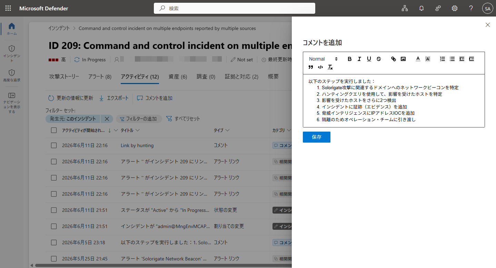

この時点で、インシデントを適切なチームに引き継ぎます。
インシデントを引き継ぐためには、次のような操作が実行できます。

- インシデント プレビューの下部から直接リンクをコピーして担当者へ連絡
- インシデントを個人またはチームのエイリアスに直接割り当て


