# Exercise05: ハンティング

#### ⏳ 推定時間: 40分

#### 💡 学習概要

プロアクティブな脅威ハンティング手順をガイドし、Microsoft Sentinel の豊富なハンティング機能を確認します。

#### 🗒️ 目次

1. [特定の MITRE 手法でのハンティング](#特定の-mitre-手法でのハンティング)
1. [ハンティング クエリ結果 を インシデントに昇格](#ハンティング-クエリ結果-を-インシデントに昇格)
1. [昇格したインシデントの確認](#昇格したインシデントの確認)


## 特定の MITRE 手法でのハンティング

セキュリティ研究者が、SolarWinds のサプライ チェーンで使用された手法について説明した次のような記事を公開しています。

- [Identified UNC2452-Related Techniques for ATT&CK](https://medium.com/mitre-attack/identifying-unc2452-related-techniques-9f7b6c7f3714)

この記事に基づいて、SOCリードは、攻撃キャンペーンの全体像を把握し、データセットの異常を特定するため、
この記事で説明されている MITRE ATT&CK の戦術と手法に基づいてプロアクティブな脅威ハンティングを実行する必要があります。

1. MITRE攻撃手法と対応するツールと方法を強調した上記の記事を確認してください。
    この演習では、 T1098 に着目します。
    この手法について理解を深めるには、次の記事を参照してください。
    https://attack.mitre.org/techniques/T1098/

1. [Microsoft Sentinel]-[脅威の管理]-[追求] を開き、「クエリ」タブへ移動

    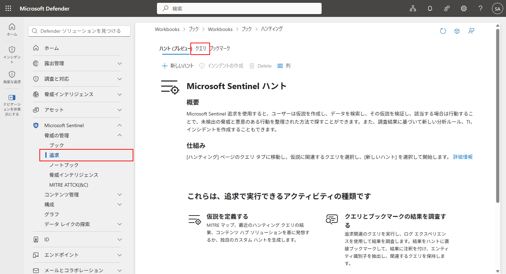

1. ハンティングページの各機能について確認

    Microsoft Sentinel に、プロアクティブなハンティング プロセスを開始するための組み込みのハンティング クエリが用意されていることがわかります。
    
    - アクションバー

        - **すべてのクエリを実行する** : <br />
            このボタンをクリックすると、すべてのアクティブなクエリが実行されます。
            これには、クエリの数とクエリされるログ データの量によっては、かなりの時間がかかる場合があります。
            結果をより迅速に取得するには、クエリのセットをフィルタリングして、実行する必要がある特定のセットに絞り込むと便利です。

    - メトリックバー

        - **アクティブ/合計クエリ** : <br />
            アクティブなクエリの数と、環境内で実行するために必要なデータソースがあるクエリの数に関する統計が表示されます。
        - **結果数/クエリの実行回数** : <br />
            現在のセッション中に実行されたクエリの数と、これらのクエリのうち結果を生成したクエリの数を示すメトリックが表示されます。
        - **ライブストリームの結果** : <br />
            ハンティングプロセス中に作成されたライブストリームの結果が表示されます。
        - **ブックマーク** : <br />
            ハンティングプロセス中に作成されたブックマークの数が表示されます。

    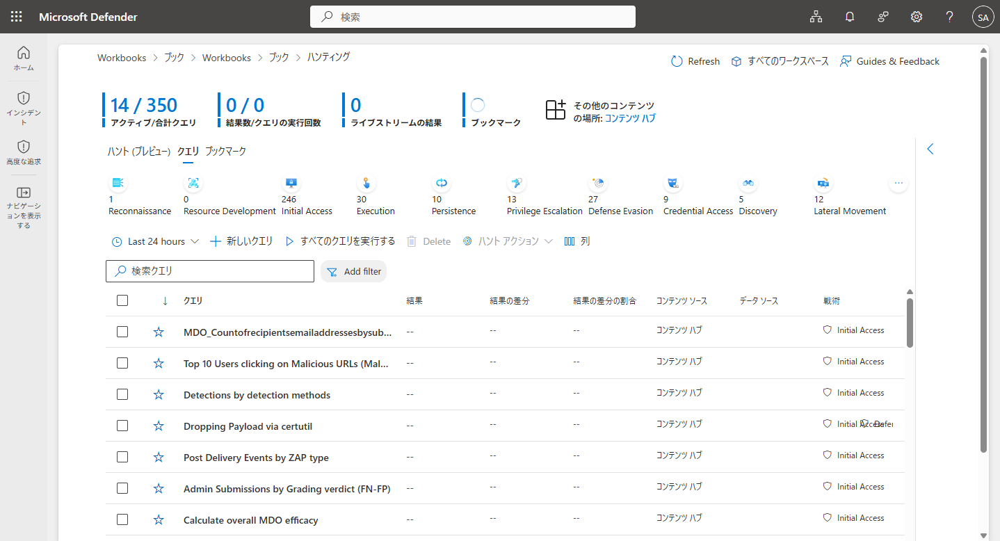

1. 「フィルターの追加」を開き、以下のフィルター条件で絞り込み

    - `方法`
        - `T1098: Account Manipulation`

    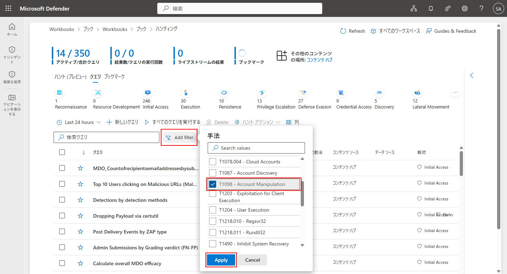

1. 表示されているクエリをすべて選択、上部アクションバーの「選択したクエリの実行」を選択

    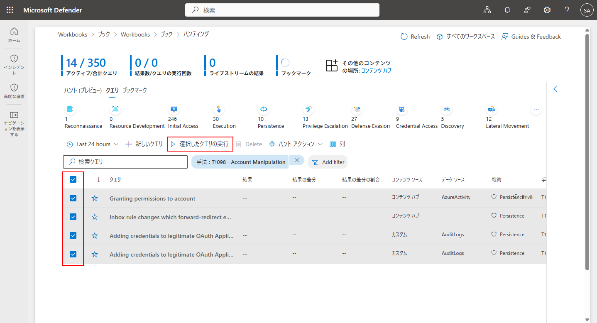

    `Adding credentials to legitimate OAuth Applications` クエリがいくつかの結果を返すことを確認

    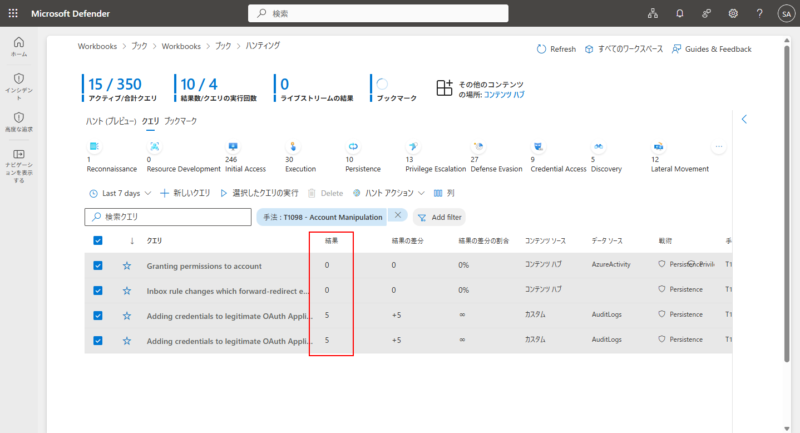

1. `Adding credentials to legitimate OAuth Applications` クエリを選択、右ペインの「結果の表示」を開く

    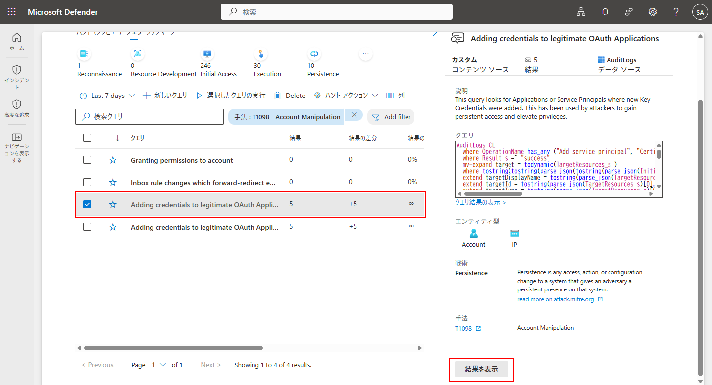

1. 「クエリを実行」 を選択して、クエリを再実行し、結果を確認

    ログ画面では、ハンティング クエリの実行が完了すると、解析されたフィールドと列と共に返されたすべてのデータを確認できます。
    ログ画面では、ハンティングクエリの実行結果の詳細について、解析されたすべての情報を確認できます。
    当該クエリ結果から、正規OAuthアプリに認証情報を追加する操作（ `Adding credentials to legitimate OAuth Applications` ）を実行したアクターIPとユーザー名がわかります。

    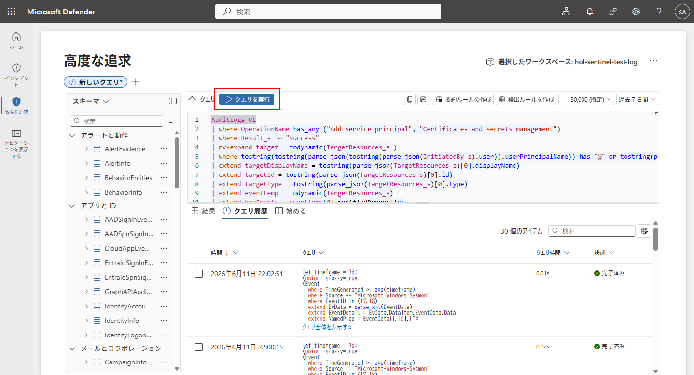

1. 結果の 1 つを展開、フィールドを確認

    ログの内容から、認証情報追加に関する以下のような情報が読み取れることを確認します。
    
    - アプリケーション名(`targetDisplayName`)
    - 追加されたキー名(`keyDisplayName`)
    - アクターのユーザー名(`InitiatingUserOrApp`)、IP(`InitiatingIpAddress`)
    - アクション(`OperationName`)

    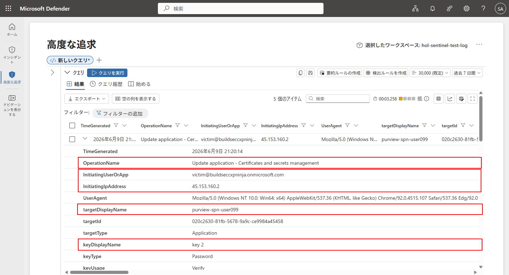

当社のSOCアナリストは、上記の調査結果から、どのアプリケーションが重要で、セキュリティリスクがある状態なのかを把握する必要があります。
これを行う 1 つの方法は、ハンティング結果から各アプリケーションの Microsoft Entra ID (MEID) を開き、それらのアクセス許可を確認し、リスクを検証することです。
当社の SOC アナリストは、組織のナレッジ ベースに従って、すべての MEID アプリケーションのリストとそのリスク レベルを確認します。

組織のナレッジ ベースには、MEID アプリケーション とそれに関連する リスクレベル の一覧を含む [CSV ファイル](../artifacts/Telemetry/HighRiskApps.csv) があります。

1. [Microsoft Sentinel]-[構成]-[ウォッチリスト] を開き、上部メニュー「新規」を選択

    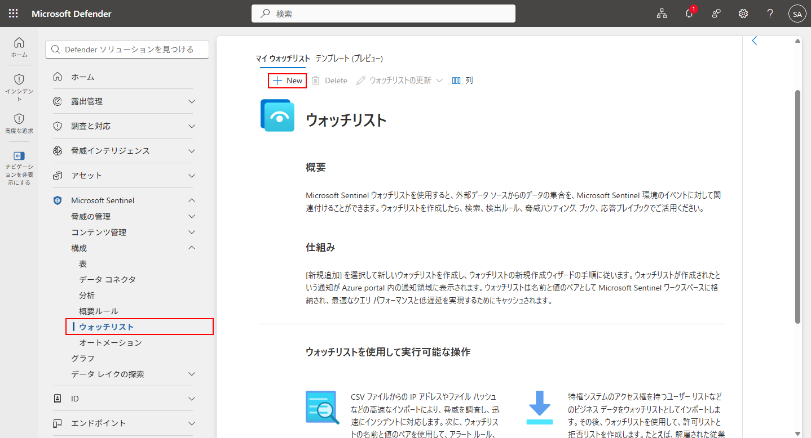

1. ウォッチリストの作成

    1. 全般

        - 名前: `HighRiskApps`
        - 説明: `高リスクアプリケーション`
        - エイリアス: `HighRiskApps`

        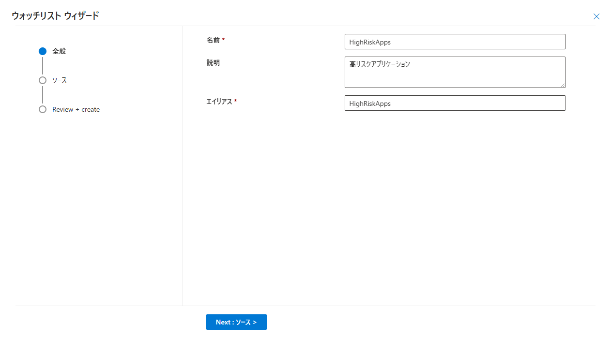

    1. ソース

        - ソースの種類: `ローカルファイル`
        - ファイルの種類: `ヘッダー付きCSVファイル(.csv)`
        - 見出しを含める行の前の行数: `0`
        - ファイルのアップロード: [`HighRiskApps.csv`](../artifacts/Telemetry/HighRiskApps.csv) をドラッグ＆ドロップでアップロード
        - 検索行: `AppName`

        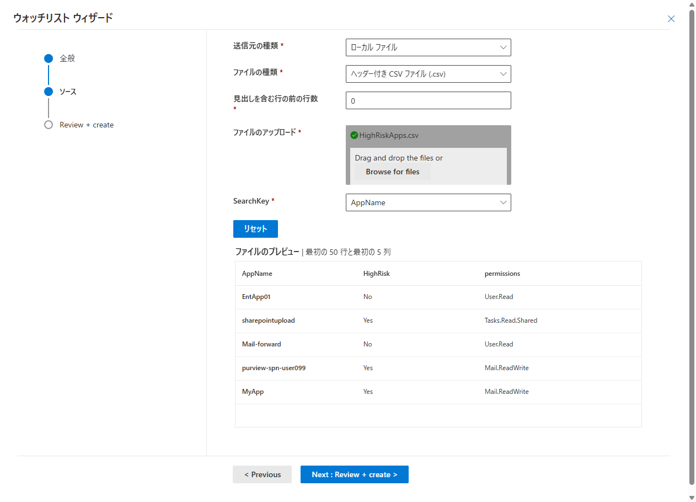

    1. 確認と作成

        「作成」を選択

        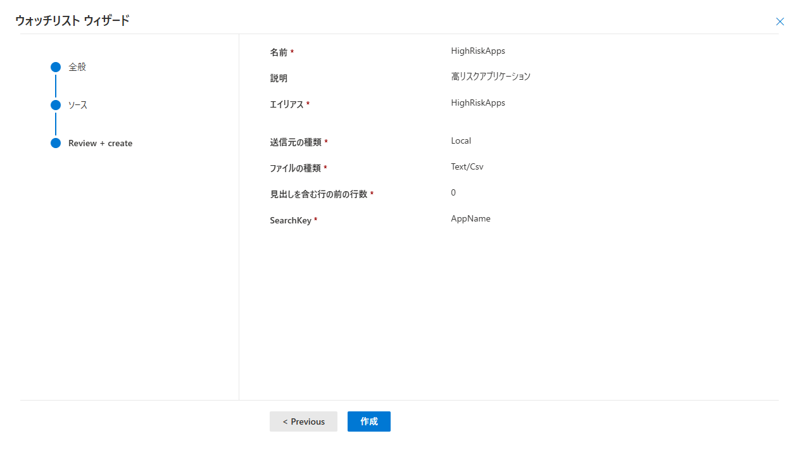

1. 作成したウォッチリストを開き直し、右ペイン「ログに表示」を選択

    (*) 即時で反映しない（クエリの実行結果が得られない）場合があるので、反映しない場合はしばらく待ってから再実行を試してみます。

    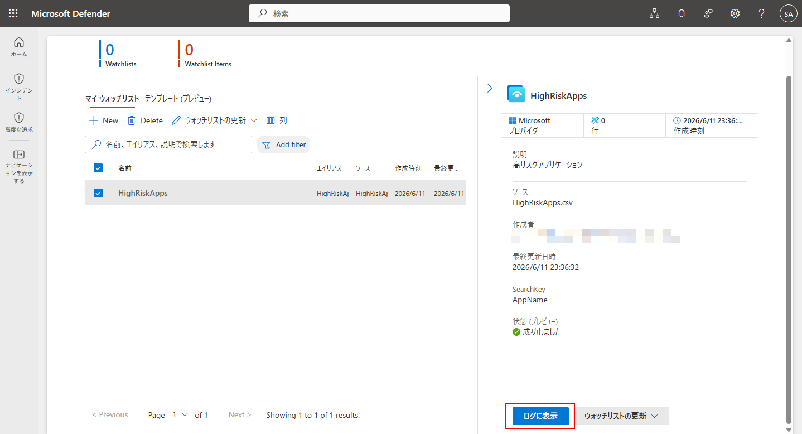

1. 以下のクエリを「クエリを実行」し、登録したウォッチリストの内容を確認

    ```
    _GetWatchlist('HighRiskApps')
    ```

    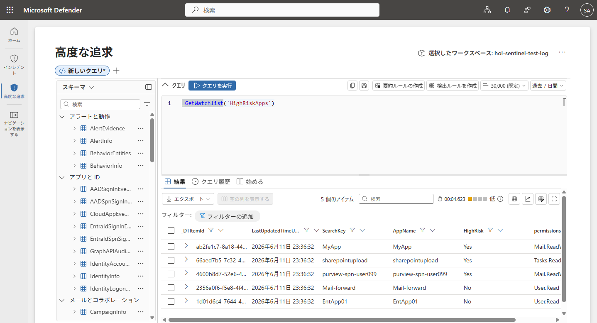

1. ハンティングクエリとウォッチリストを結合した以下のクエリを実行

    ```
    _GetWatchlist('HighRiskApps')
    | join 
    (
    AuditLogs_CL
    | where OperationName has_any ("Add service principal", "Certificates and secrets management")
    | where Result_s =~ "success"
    | mv-expand target = todynamic(TargetResources_s)
    | where tostring(tostring(parse_json(tostring(parse_json(InitiatedBy_s).user)).userPrincipalName)) has "@" or tostring(parse_json(InitiatedBy_s).displayName) has "@"
    | extend targetDisplayName = tostring(parse_json(TargetResources_s)[0].displayName)
    | extend targetId = tostring(parse_json(TargetResources_s)[0].id)
    | extend targetType = tostring(parse_json(TargetResources_s)[0].type)
    | extend eventtemp = todynamic(TargetResources_s)
    | extend keyEvents = eventtemp[0].modifiedProperties
    | mv-expand keyEvents
    | where keyEvents.displayName =~ "KeyDescription"
    | extend set1 = parse_json(tostring(keyEvents.newValue))
    | extend set2 = parse_json(tostring(keyEvents.oldValue))
    | extend diff = set_difference(set1, set2)
    | where isnotempty(diff)
    | parse diff with * "KeyIdentifier=" keyIdentifier: string ",KeyType=" keyType: string ",KeyUsage=" keyUsage: string ",DisplayName=" keyDisplayName: string "]" *
    | where keyUsage == "Verify" or keyUsage == ""
    | extend AdditionalDetailsttemp = todynamic(AdditionalDetails_s)
    | extend UserAgent = iff(todynamic(AdditionalDetailsttemp[0]).key == "User-Agent", tostring(AdditionalDetailsttemp[0].value), "")
    | extend InitiatedByttemp = todynamic(InitiatedBy_s)
    | extend InitiatingUserOrApp = iff(isnotempty(InitiatedByttemp.user.userPrincipalName), tostring(InitiatedByttemp.user.userPrincipalName), tostring(InitiatedByttemp.app.displayName))
    | extend InitiatingIpAddress = iff(isnotempty(InitiatedByttemp.user.ipAddress), tostring(InitiatedByttemp.user.ipAddress), tostring(InitiatedByttemp.app.ipAddress))
    | project-away diff, set1, set2, eventtemp, AdditionalDetailsttemp, InitiatedByttemp
    | project-reorder
    TimeGenerated,
    OperationName,
    InitiatingUserOrApp,
    InitiatingIpAddress,
    UserAgent,
    targetDisplayName,
    targetId,
    targetType,
    keyDisplayName,
    keyType,
    keyUsage,
    keyIdentifier,
    CorrelationId
    | extend
    timestamp = TimeGenerated,
    AccountCustomEntity = InitiatingUserOrApp,
    IPCustomEntity = InitiatingIpAddress
    ) on $left.AppName == $right.targetDisplayName
    | where HighRisk == "Yes"
    ```

    ご覧のとおり、上記のクエリでは、結合演算子を使用して 2 つのデータ ストリーム (高リスクのウォッチリストと "正当な OAuth アプリケーションへの資格情報の追加" ハンティング クエリ結果) を結合しています。
    これら 2 つのデータセットは、アプリケーション名の列に基づいて結合しています。
    where演算子で結果をフィルタリングして、リスクの高いアプリケーションのみを表示します。

    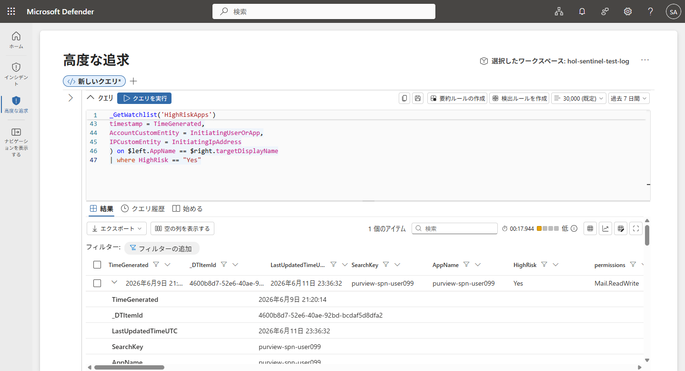

    **(*) このウィンドウは、次の演習で引き続き作業するため、開いたままにしてください。**


## ハンティング クエリ結果 を インシデントに昇格

高度な追求 で 行ったハンティング結果に悪意のあるアクティビティが含まれていると判断した場合、ハンティング結果（ログ分析結果）から新しいインシデントを作成するか、既存のインシデントにアタッチできます。

今回は以下の手順でハンティング クエリ結果から新しいインシデントを作成します。

1. ログ検索画面（ [調査と対応]-[追求]-[高度な追求] ）で、前の演習で作成した "結合ハンティング クエリ" を開く

    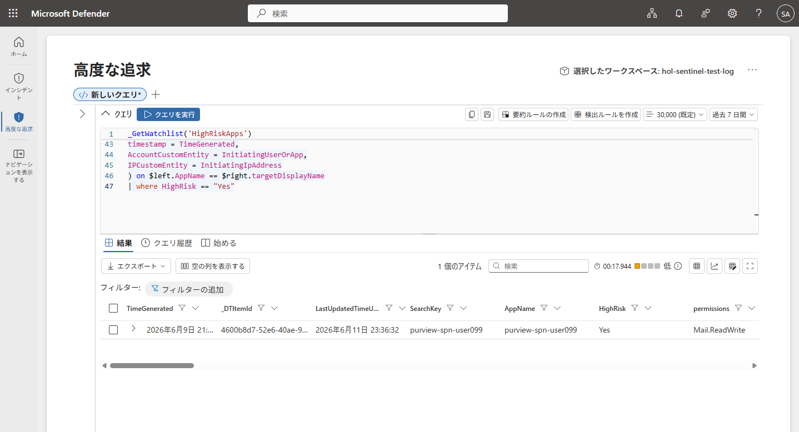

1. 表示された検索結果の行をすべて選択、アクションメニュー「インシデントへのリンク」を選択

    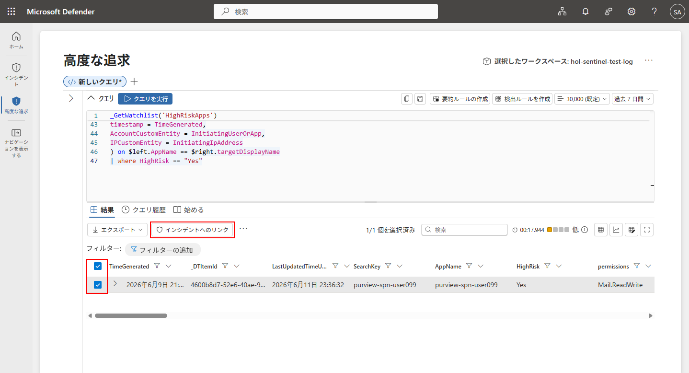

1. インシデントの作成

    1. アラートの詳細

        - `新しいインシデントを作成する`
        - アラートのタイトル: `victim@buildseccxpninja.onmicrosoft.com が高リスクアプリ purview-spn にキー追加`
        - 重大度: `中`
        - カテゴリ: `アクセス許可`
        - 説明: `高リスクアプリに対するサービスプリンシパル追加や証明書・秘密情報の変更を成功させたユーザー情報。恒常的な不正アクセスや権限維持の起点になる可能性のある操作を捉えた監視。`
        - おすすめアクション: (空欄)

        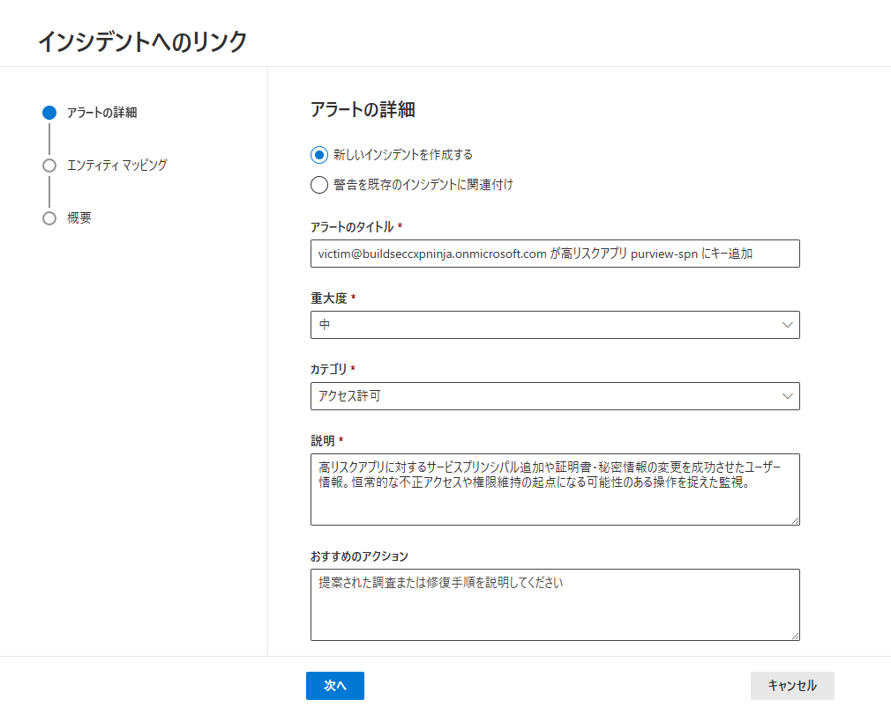

    1. エンティティマッピング

        - 影響を受けた資産
            
            | エンティティ | 識別子 | 列 |
            | --- | --- | --- |
            | User | `UPN` | `AccountCustomEntity` |
            | Cloud application | `AppId` | `targetId` |
            |                   | `Name`  | `targetDisplayName` |
        
        - 関連するエビデンス

            | エンティティ | 識別子 | 列 |
            | --- | --- | --- |
            | IP | `Address` | `IPCustomEntity` |

        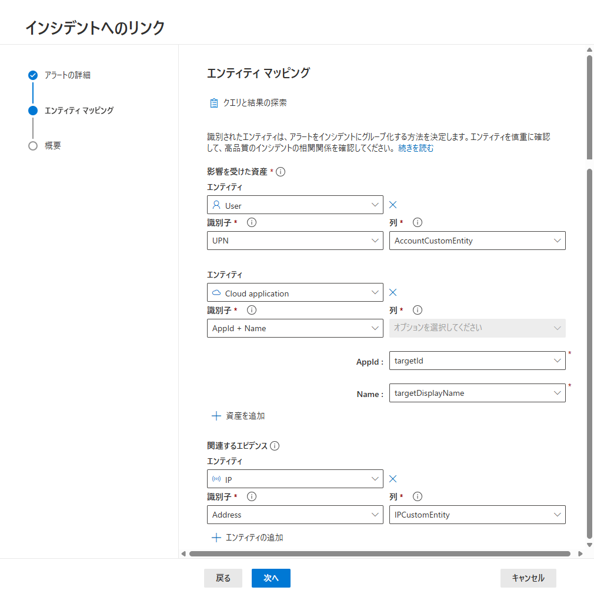

    1. 概要

        内容を確認して「送信」

        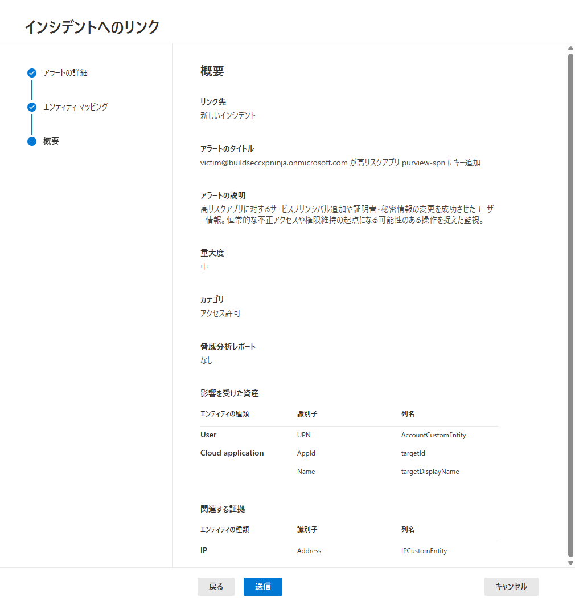


## 昇格したインシデントの確認

1. [Microsoft Sentinel]-[調査と対応]-[インシデントとアラート]-[インシデント] を開き、作成したインシデント `victim@buildseccxpninja.onmicrosoft.com が高リスクアプリ purview-spn にキー追加` を選択

    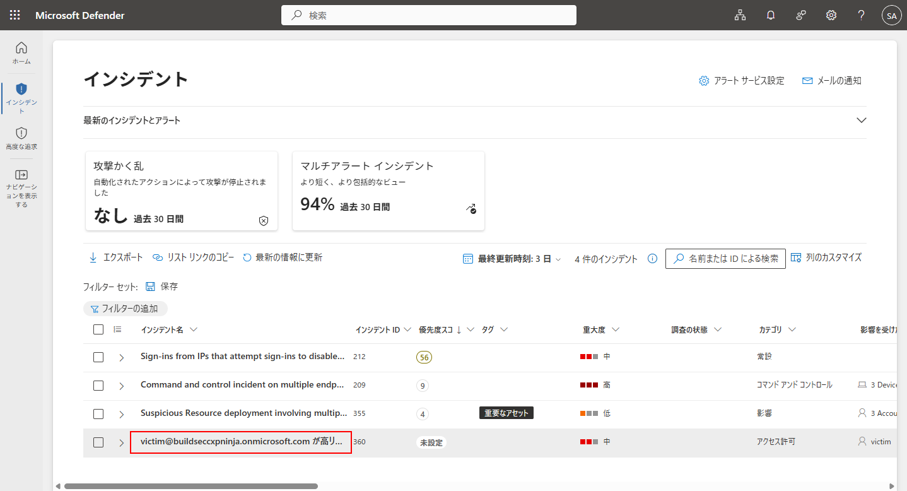

1. インシデントグラフの確認

    グラフィカルな画面に、エンティティマッピングで指定した
    エンティティが表示され、インシデントの調査ができることを確認

    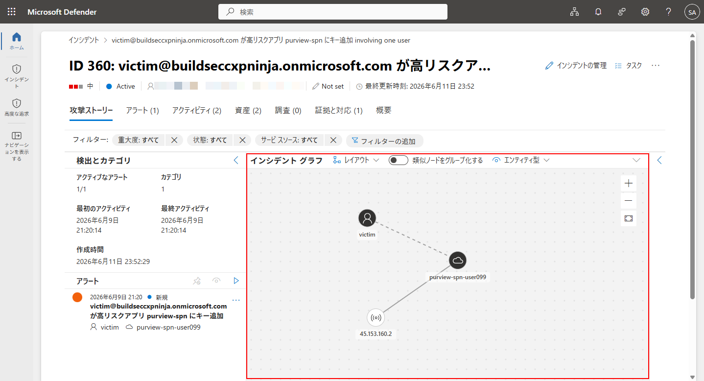


