# Exercise06: ウォッチリスト

#### ⏳ 推定時間: 20分

#### 💡 学習概要

イベントの相関と強化に Microsoft Sentinel ウォッチリストを使用する方法を説明します。
ウォッチリストを作成すると、検索、検出ルール、脅威ハンティング、および対応プレイブックで使用できます。

#### 🗒️ 目次

1. [ウォッチリストを作成](#ウォッチリストを作成)
1. [分析ルールにウォッチリストを利用](#分析ルールにウォッチリストを利用)


## ウォッチリストを作成

1. [Microsoft Sentinel]-[構成]-[ウォッチリスト] を開き、「新規」を選択

    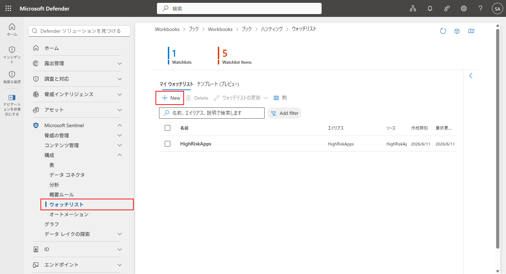

1. ウォッチリストの新規作成

    1. 全般

        - 名前: `PenTestsIPaddresses`
        - 説明: `ペネトレーションテスト中に利用したIPアドレス`
        - エイリアス: `PenTestsIPaddresses`

        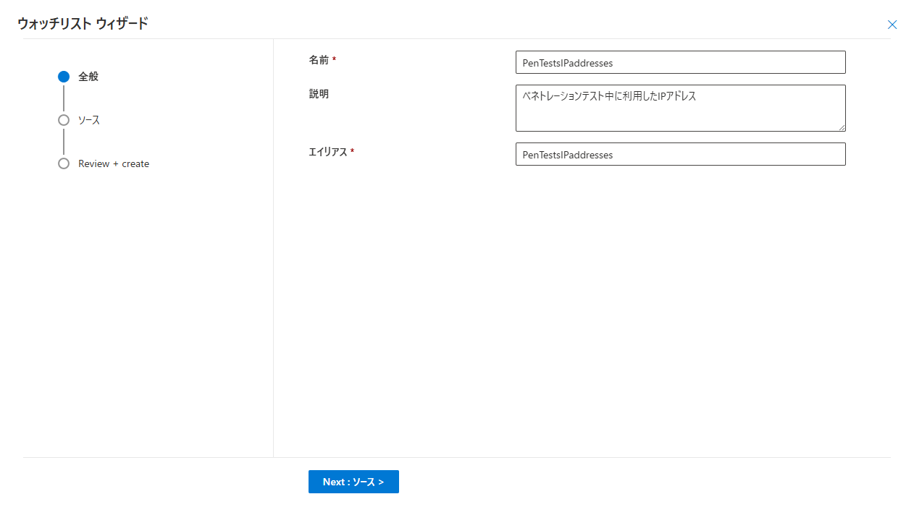

    1. ソース

        - ソースの種類: `ローカルファイル`
        - ファイルの種類: `ヘッダー付きCSVファイル(.csv)`
        - 見出しを含む行の前の行数: `0`
        - ファイルのアップロード: "[PenTestsIPaddresses.csv](../artifacts/Telemetry/PenTestsIPaddresses.csv)" ダウンロードしてエリアへドラッグ＆ドロップ
        - SearchKey: `IPAddress`

        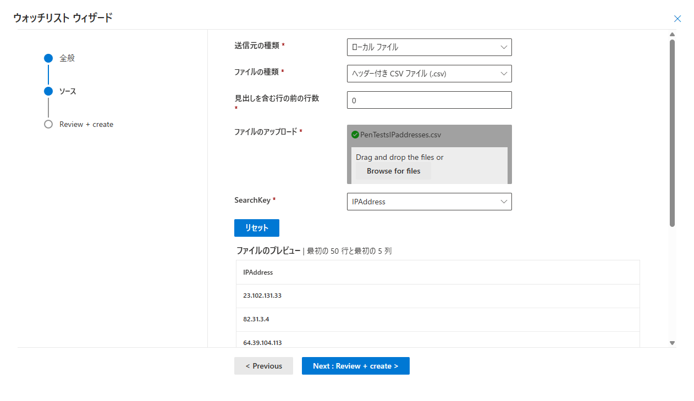

    1. 確認と作成

        「作成」を選択

        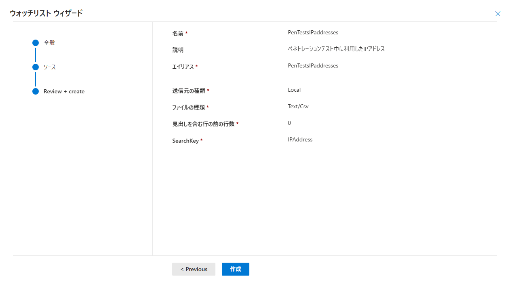


<div style="text-align: center; font-size: 1.2em; font-weight: bold; margin: 4em;">
～ しばらく待ち (数分程度) ☕☕☕ ... ～
</div>

1. 作成した `PenTestsIPaddresses` を選択、「ログに表示」を開く

    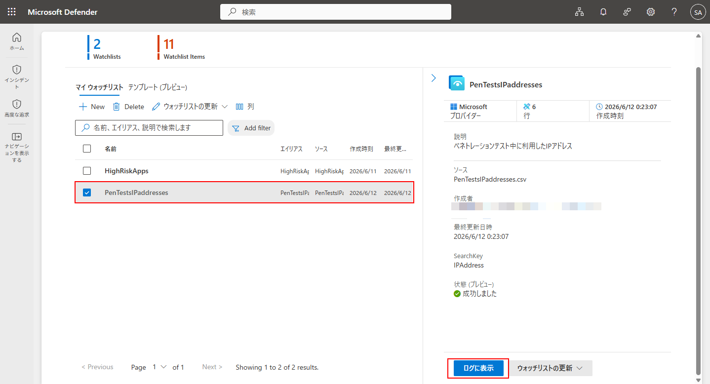

1. CSV情報の登録を確認

    次のKQLを利用して、登録済みIPアドレス群が呼び出せていることを確認

     ```
     _GetWatchlist('PenTestsIPaddresses')
     ```

    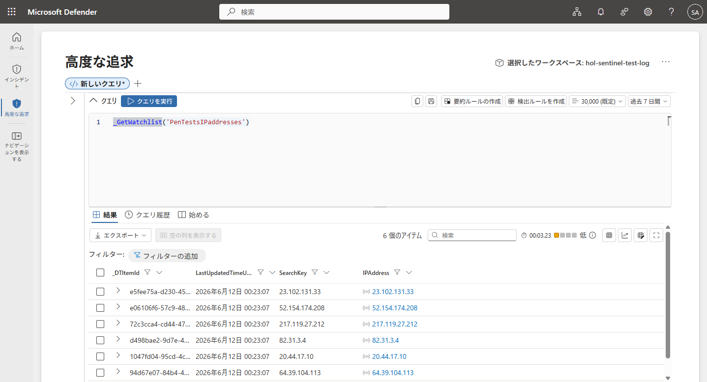


## 分析ルールにウォッチリストを利用

1. [Microsoft Sentinel]-[コンテンツ管理]-[コンテンツ ハブ] を開く

    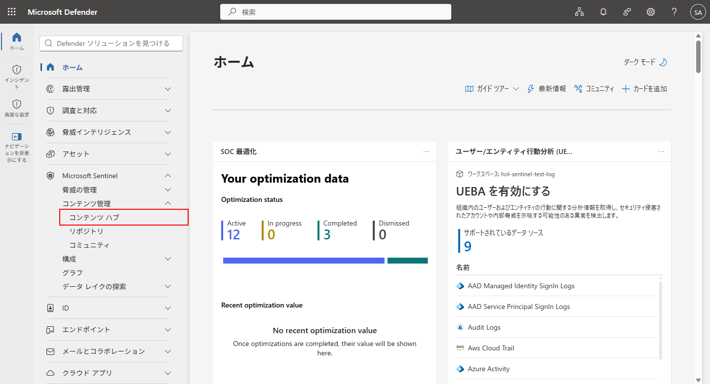

1. `High count of connections by client IP on many ports` を検索して選択、「インストール」

    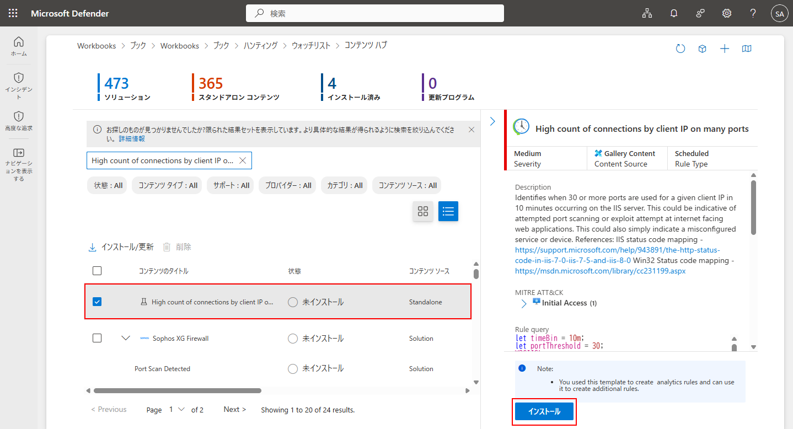

1. インストール完了後、「ルールの作成」を選択

    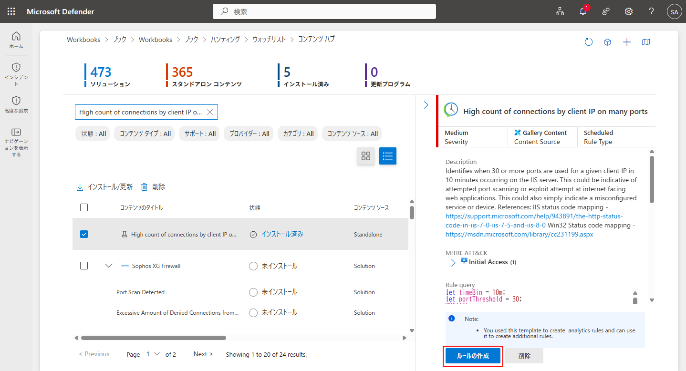

1. 分析ルールの作成

    1. 全般

        デフォルトまま

        <!--  -->

    1. ルールのロジックを設定

        ルールのクエリにウォッチリストで絞り込むよう実装を2カ所追記

        ```
        let timeBin = 10m;
        let portThreshold = 30;
        // ▼▼▼▼▼ ADD START ▼▼▼▼
        let PenTestIPAddresses = _GetWatchlist('PenTestsIPaddresses') | project IPAddress;
        // ▲▲▲▲▲ ADD END ▲▲▲▲▲▲
        W3CIISLog
        | extend scStatusFull = strcat(scStatus, ".",scSubStatus)
        // Map common IIS codes

        ... (省略) ...

        // Count of attempts by client IP on many ports
        | summarize makeset(sPort), makeset(decodedUriQuery), ... (省略) ...
        | extend portCount = arraylength(set_sPort)
        | where portCount >= portThreshold
        // ▼▼▼▼▼ ADD START ▼▼▼▼
        | where cIP !in (PenTestIPAddresses)
        // ▲▲▲▲▲ ADD END ▲▲▲▲▲▲
        | project TimeGenerated, cIP,  ... (省略) ...
        | order by portCount
        ```

        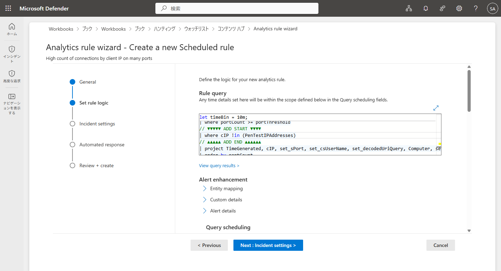

    1. インシデントの設定

        - インシデントの設定: `有効`
        - アラートのグループ化: `有効`
            - 選択した期間: `5時間`
            - グループ化: `すべてのエンティティが一致した場合にアラートを1つのインシデントにグループ化する`

        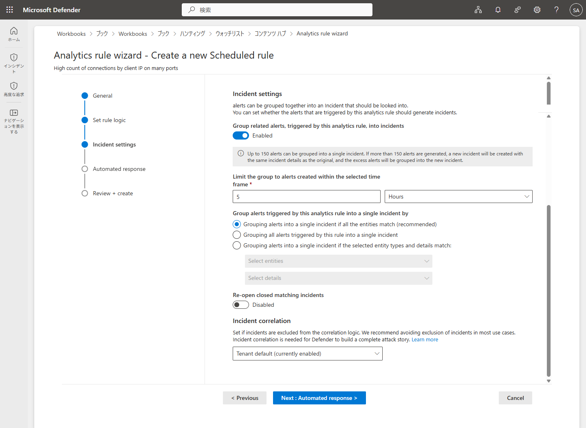

    1. 自動応答

        デフォルトまま

        <!--  -->

    1. 確認と作成

        「保存」を選択

        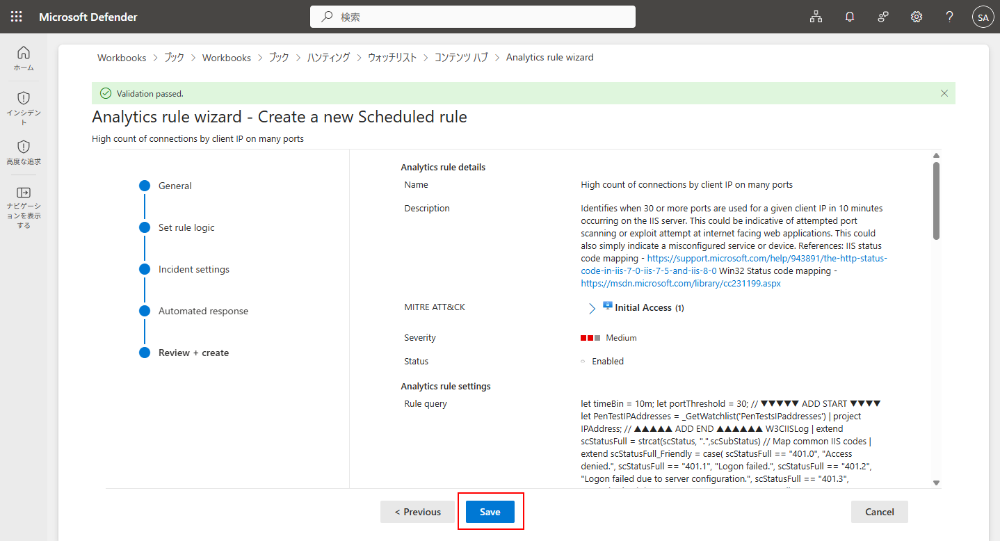


